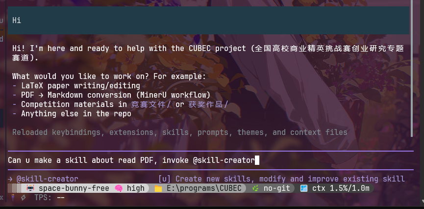

# pi-at-skills

用 `@` 在输入框任意位置调用 pi 的 skill，同时保留 `@` 的文件附件能力。适合已经习惯 opencode v2 输入方式的 pi 用户；改动方式见「安装」，限制见「触发条件与例外」。

pi 原生只有 `/skill:name` 能调用 skill，且必须写在消息的第一行：编辑器在 `isSlashMenuAllowed()` 中限定 `cursorLine === 0`。本扩展不修改 pi 的斜杠命令，改为在 `@` 补全列表中并入 skill：

- 同一个 `@` 列表包含文件（pi 原生顺序）和全部可调用 skill，输入时两边同时收窄。
- `@skill-name` 出现在句子任意位置都生效，一条消息可以调用多个 skill。
- `@src/foo.ts`、`@notes.md` 交给 pi 原生路径补全，不会被当作 skill。
- 用户输入的 prompt 不被改写：skill 正文作为独立的 `✦ @skills` 上下文消息注入，`/fuck` 回滚、rewind 和重编辑看到的都是原文。

```text
# pi 原生：只能写在消息开头，一条消息一个 skill
$tdd 实现这个功能

# 本扩展：任意位置，可以写多个
先审查 @code-review，再 @humanizer-zh 润色结论

# 文件与 skill 共用 @ 键
@pdf 按 AGENTS.md 的规则处理 E:\programs\CUBEC\AGENTS.md
```



英文文档见 [README.en.md](README.en.md)。

## 环境要求

| 项目 | 要求 |
| --- | --- |
| pi | 1.0 及以上 |
| Node.js | 22.19 及以上 |
| 凭据 | 不需要 |

扩展以 TypeScript 源码形式分发，由 pi 的 jiti 运行时在加载时编译，没有构建步骤。

## 安装

从 Git 仓库安装：

```bash
pi install git:github.com/Ttungx/pi-at-skills
```

在 pi 内执行 `/reload` 使配置生效。

仅本次运行试用，不写入 settings：

```bash
pi -e /path/to/pi-at-skills
```

包发布到 npm 后，安装命令改为 `pi install npm:pi-at-skills`。

## 用法

| 输入 | 行为 |
| --- | --- |
| `@` | 弹出列表：文件在前，随后是全部 skill（与 pi 原生行为一致）。 |
| `@pd` | 输入字符后，命中的 skill 排在文件之前，避免回车选中同名前缀的文件。skill 按模糊匹配过滤，`@impv` 可命中 `improve-codebase`，前缀命中排在前面。 |
| `@src/comp` | 查询串含 `/` 或 `\` 时，只走 pi 原生路径补全。 |
| `@skill-name` | 提交前注入该 skill 的 `SKILL.md` 正文（去掉 frontmatter），一条消息可注入多个。 |
| `@@skill-name` | 转义，保持字面量 `@skill-name`。 |

skill 条目右侧与 pi 原生 `/skill:` 列表一致，显示作用域标签和 skill 描述，例如 `[u] Create new skills, ...`。选中 skill 条目后不补尾随空格；pi 的文件补全会自动补一个空格。
| `$skill-name` | 兼容 pi-skills-mention 的旧写法，仍然可用；补全只在 `@` 上触发。 |

注入的 skill 以 pi 原生 `<skill name=... location=...>` 块送达模型，界面上渲染为一行折叠摘要，按 `ctrl+o` 展开全文。同一会话分支上已注入过的 skill 不重复注入。

## 触发条件与例外

本扩展把行内写出的 `@skill-name` 称为 mention，把 `@` 和 `$` 称为符号。

- 只有 pi 已加载的 skill 名才构成 mention。`@PATH`、`@not-installed` 等未知 token 原样保留在文本中。
- 符号必须位于 token 边界：邮箱 `user@example.com`、`a@b`、路径 `E:/x/@pdf`、装饰器 `@Component` 均不触发。
- 紧跟 `.` 或 `/` 的 token 不构成 mention：`@notes.md`、`@src/foo.ts` 交给文件补全。
- skill 按模糊算法匹配。若某个 skill 名是某个文件名的前缀，输入字符后 skill 行排在文件行之前；裸 `@` 时文件行在前，需要用方向键选中 skill 行。

## 实现说明

| 文件 | 职责 |
| --- | --- |
| `src/index.ts` | 扩展入口。`input` 事件扫描 mention，`before_agent_start` 事件注入 skill 正文，并注册消息渲染器。 |
| `src/mention.ts` | `@` 与 `$` token 扫描，含路径、邮箱和边界规则。 |
| `src/autocomplete.ts` | 通过 `ctx.ui.addAutocompleteProvider` 把 skill 并入 pi 原生 `@` 文件补全。 |
| `src/discover.ts` | skill 发现。优先复用 pi 已加载的 skill 集合，首轮对话回落到 pi 自己的 `loadSkills`。 |
| `src/skill-registry.ts` | 读取 `SKILL.md`，构造 `<skill>` 块；同时把 frontmatter 中的描述和作用域标签带入 `@` 列表。 |

设计上的一处约束：pi 的 `setAutocompleteTriggerCharacters` 会过滤 `/` 和空白字符，扩展无法把 `/` 注册为触发字符。`@` 本来就在默认触发字符中，因此本扩展改为包装原生 provider，并在 `applyCompletion` 中按条目类型分流：skill 条目替换自己对应的 token，其余条目交还原生 provider，由它补回 `@`。

## 故障排查

`@` 列表中不显示 skill 条目时，按以下顺序检查：

1. 执行 `/reload`，确认扩展已加载。
2. 确认该 skill 已被 pi 加载。`SKILL.md` 缺少 `description` 或格式错误时，pi 不会加载它，该 skill 也不会出现在列表中。
3. 设置环境变量 `PI_SKILLS_MENTION_DEBUG=1` 后启动 pi，提交一条带 `@skill-name` 的消息。终端会打印本次 `queued` 和 `injected` 的 skill 名。没有任何输出说明 mention 未被识别。

提交后没有出现 `✦ @skills` 摘要行时，检查该 skill 是否在当前会话分支上已经注入过：同一分支不重复注入。

## 开发与测试

```bash
npm test
```

测试使用 node 内置 test runner 与类型剥离，不安装任何依赖，不导入 pi 运行时。CI 在 ubuntu 和 windows 上分别以 Node.js 22.19 和 24 运行同一套测试。

## 版本策略

包版本号与 pi 版本号保持一致，当前为 1.0.4。升级 pi 后同步修改 `package.json` 中的 `version`，并按 [RELEASING.md](RELEASING.md) 打同名标签发布。

## 致谢与许可

本项目 fork 自 [pi-skills-mention](https://github.com/WufeiHalf/pi-skills-mention)（MIT，wufei）。相对上游的改动：符号由 `$` 改为 `@`；补全列表与文件补全合并；增加 token 边界规则；补充 `shouldTriggerFileCompletion` 委托。许可为 MIT，版权声明见 [LICENSE](LICENSE)。